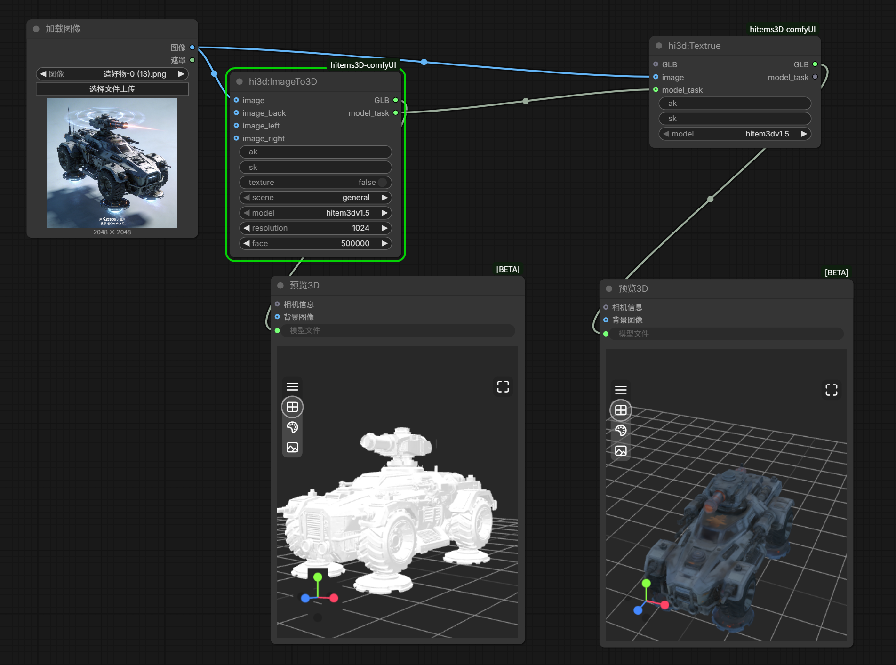
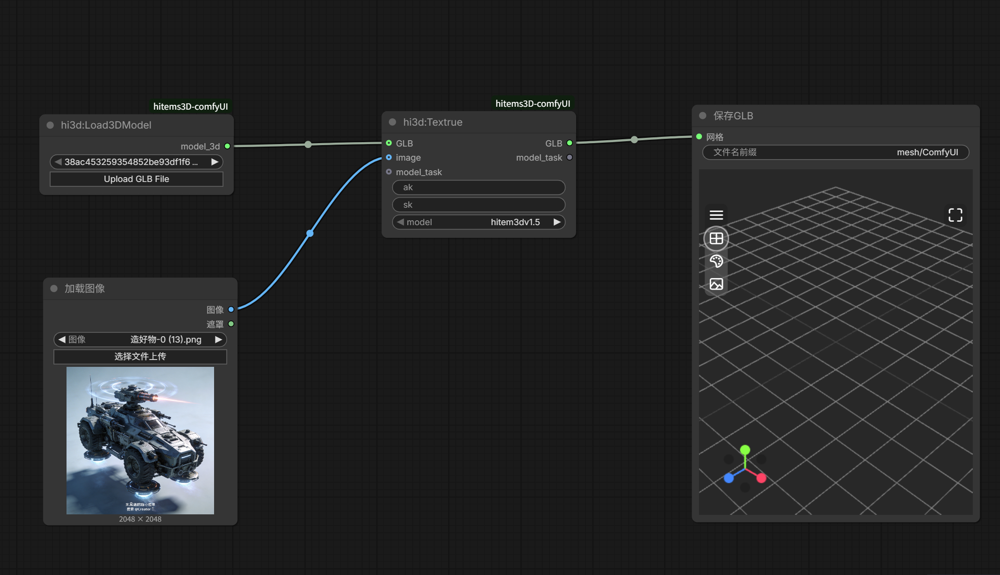

# hitem3d-comfyUI

ComfyUI custom node package for [Hitem3D](https://www.hitem3d.ai/) Image-to-3D API. Generate high-quality 3D models from images using Hitem3D AI services.

## Features

- **Image to 3D** — Generate 3D models (GLB) from a single image or multi-view images.
- **Unified scene switch** — Use the `scene` parameter to switch between general object models and portrait/scene models in one node.
- **Model-resolution linkage** — The node UI automatically filters available model versions and resolutions based on the selected `scene` and `model`.
- **Texture regeneration** — Re-texture existing 3D models based on a reference image.
- **Load 3D model** — Load a GLB file from disk with a built-in upload button (GLB only).

## Installation

### Download from Hitem3D Website

1. Download the `hitem3d-comfyUI` archive from the [Hitem3D website](https://www.hitem3d.ai/) or the project releases page.
2. Extract it into the `ComfyUI/custom_nodes` directory.
3. Install Python dependencies via the **ComfyUI built-in terminal** (click the terminal icon in the ComfyUI Manager toolbar) or any terminal with the same Python environment:

```bash
cd ComfyUI/custom_nodes/hitem3d-comfyUI
pip install -r requirements.txt
```

### ComfyUI Manager

Search for `hitem3d` in [ComfyUI Manager](https://github.com/ltdrdata/ComfyUI-Manager) and install it directly.

## Configuration

An API key pair (ak / sk) is required. Register at the [Hitem3D website](https://www.hitem3d.ai/) to obtain one.

### Option 1: config.json (Recommended)

Edit `config.json` in the node directory:

```json
{
    "hitem3d_ak": "your_access_key",
    "hitem3d_sk": "your_secret_key"
}
```

### Option 2: Environment Variables

```bash
export hitem3d_ak=your_access_key
export hitem3d_sk=your_secret_key
```

> If ak/sk are configured via `config.json` or environment variables, the input fields on the nodes can be left empty.

## Nodes

### hitem3d:ImageTo3D

Generates a 3D model (GLB) from a single image or multi-view images.

| Parameter | Type | Description |
|-----------|------|-------------|
| `ak` | STRING | API Access Key (leave empty if configured globally) |
| `sk` | STRING | API Secret Key (leave empty if configured globally) |
| `image` | IMAGE | Main front image (**required**) |
| `image_back` | IMAGE | Back reference image (optional, for multi-view) |
| `image_left` | IMAGE | Left reference image (optional, for multi-view) |
| `image_right` | IMAGE | Right reference image (optional, for multi-view) |
| `texture` | BOOLEAN | Generate texture maps (default: `False`) |
| `scene` | COMBO | Scene preset: `general` / `portrait` |
| `model` | COMBO | Model version (filtered by `scene`, see table below) |
| `resolution` | COMBO | Generation resolution (filtered by `model`, see table below) |
| `face` | INT | Target poly count (100,000–2,000,000; default: 500,000) |

**Scene → Model mapping:**

| Scene | Available Models |
|-------|-----------------|
| `general` | `hitem3dv1.5`, `hitem3dv2.0` |
| `portrait` | `scene-portraitv1.5`, `scene-portraitv2.0`, `scene-portraitv2.1` |

**Model → Resolution mapping:**

| Model | Available Resolutions |
|-------|----------------------|
| `hitem3dv1.5` | `512`, `1024`, `1536`, `1536pro` |
| `hitem3dv2.0` | `1536`, `1536pro` |
| `scene-portraitv1.5` | `1536` |
| `scene-portraitv2.0` | `1536pro` |
| `scene-portraitv2.1` | `1536pro` |

**Outputs:**

| Output | Type | Description |
|--------|------|-------------|
| `GLB` | FILE3DGLB | Downloaded 3D model in GLB format |
| `model_task` | HITEM3D_MODEL_TASK | Task info, can be passed to the Texture node |

---

### hitem3d:Texture

Regenerates texture maps for an existing 3D model based on a reference image.

| Parameter | Type | Description |
|-----------|------|-------------|
| `ak` | STRING | API Access Key (leave empty if configured globally) |
| `sk` | STRING | API Secret Key (leave empty if configured globally) |
| `GLB` | FILE3DGLB | Input 3D model in GLB format |
| `image` | IMAGE | Texture reference image (**required**) |
| `model_task` | HITEM3D_MODEL_TASK | Upstream task info from ImageTo3D (optional) |
| `model` | COMBO | Model version: `hitem3dv1.5` / `scene-portraitv1.5` |

> Provide either `model_task` **or** `GLB`. When `model_task` is connected, its model URL is used automatically without re-uploading.

**Outputs:** Same as ImageTo3D.

---

### hitem3d:Load3DModel

Loads a GLB file from disk for use with the Texture node. Includes an **Upload GLB File** button to browse and upload files from your local computer.

| Parameter | Type | Description |
|-----------|------|-------------|
| `model_file` | COMBO | Select a GLB file from the dropdown or upload a new one |

**Output:**

| Output | Type | Description |
|--------|------|-------------|
| `model_3d` | FILE3D | Loaded 3D model, can be connected to the Texture node's `GLB` input |

## Example Workflows

### Image to 3D

Generate a 3D model from a single image:



### Texture Regeneration

Re-texture an existing 3D model with a reference image:



## License

MIT
